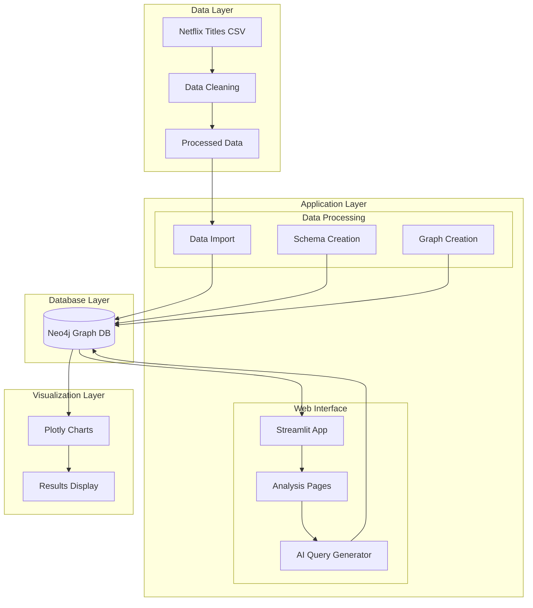
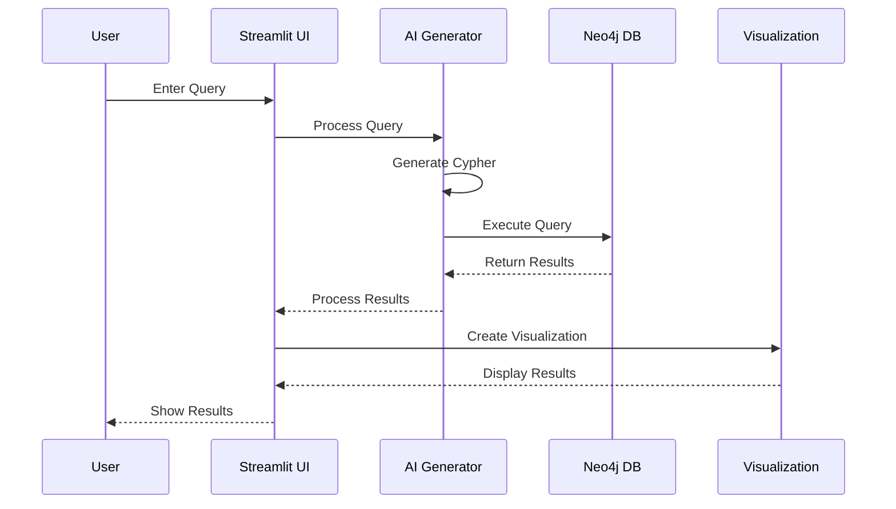

# Netflix Analysis System Architecture

## Overview
This document outlines the architecture of the Netflix Analysis application, which provides interactive visualization and analysis of Netflix content data using Neo4j graph database and Streamlit.

## System Architecture Flowchart


## Data Flow Flowchart


## System Components

### 1. Data Layer
- **Data Source**: Netflix Titles Dataset (CSV files)
  - `netflix_titles.csv`: Raw dataset
  - `netflix_titles_cleaned.csv`: Processed dataset

### 2. Database Layer
- **Neo4j Graph Database**
  - Hosted on Neo4j Aura (Cloud Service)
  - Schema:
    - Nodes: Movie, TVShow, Director, Actor, Country, Genre
    - Relationships: ACTED_IN, DIRECTED, RELEASED_IN, BELONGS_TO_GENRE
  - Connection: Secure connection using environment variables

### 3. Application Layer
#### Core Components
1. **Data Processing**
   - `clean_netflix_data.py`: Data cleaning and preprocessing
   - `create_schema.py`: Neo4j schema creation
   - `import_data.py`: Data import to Neo4j
   - `create_neo4j_graph.py`: Graph structure creation

2. **Web Interface (Streamlit)**
   - Main Application (`Home.py`)
   - Analysis Pages:
     - `1_🎭_Actor_Director_Analysis.py`: Actor and Director analysis
     - `2_🎬_Genre_Analysis.py`: Genre-based analysis
     - `4_🤖_AI_Query_Generator.py`: Natural language query interface

3. **AI Integration**
   - Google Gemini API for natural language processing
   - Query generation and optimization
   - Error handling and fallback mechanisms

### 4. Visualization Layer
- **Plotly**: Interactive visualizations
  - Bar charts
  - Pie charts
  - Treemaps
  - Sunburst charts
  - Heatmaps
  - Line charts

## Data Flow

1. **Data Ingestion**
   ```
   Raw CSV → Data Cleaning → Neo4j Import → Graph Creation
   ```

2. **Query Processing**
   ```
   User Input → AI Query Generation → Cypher Query → Neo4j Execution → Results Processing → Visualization
   ```

3. **User Interface Flow**
   ```
   Streamlit Pages → User Interaction → Query Execution → Results Display
   ```

## Security
- Environment variables for sensitive data
- Secure Neo4j connection
- API key management
- Input validation and sanitization

## Dependencies
- Python 3.x
- Neo4j Python Driver
- Streamlit
- Pandas
- Plotly
- Google Generative AI
- python-dotenv

## Error Handling
- Database connection management
- Query execution error handling
- AI model fallback mechanisms
- User input validation
- Data processing error handling

## Performance Considerations
- Query optimization
- Connection pooling
- Result set limiting
- Caching mechanisms
- Efficient data structures

## Future Enhancements
1. Additional visualization types
2. Enhanced AI query capabilities
3. Real-time data updates
4. User authentication
5. Advanced analytics features
6. Export functionality
7. Custom visualization options 